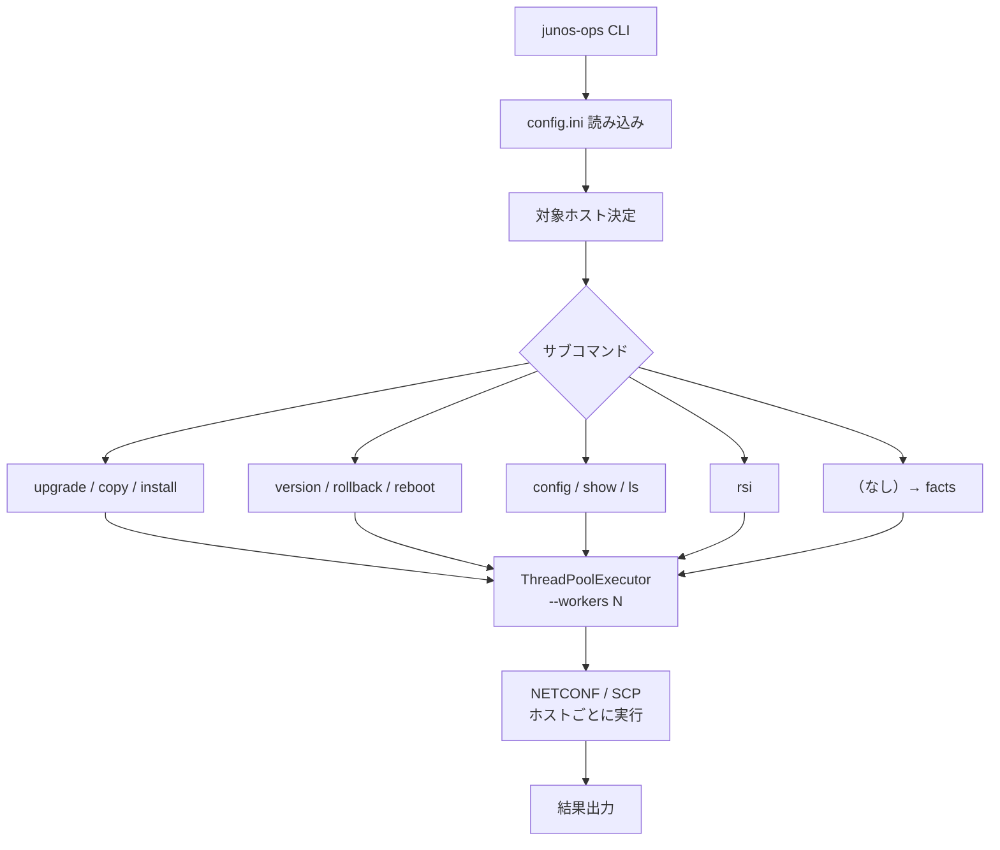
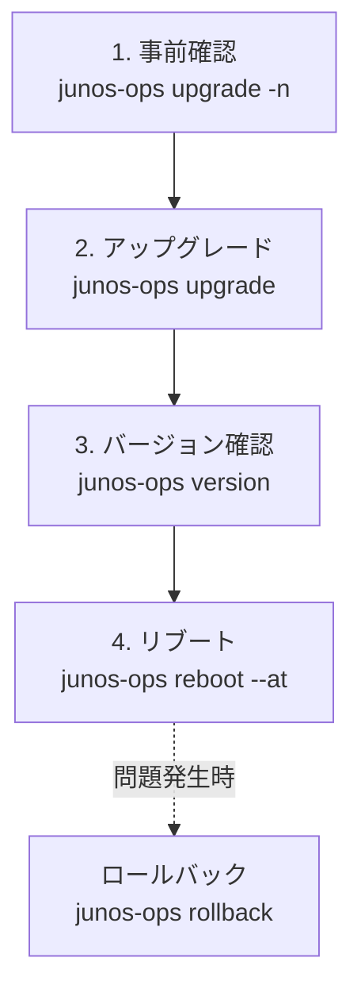
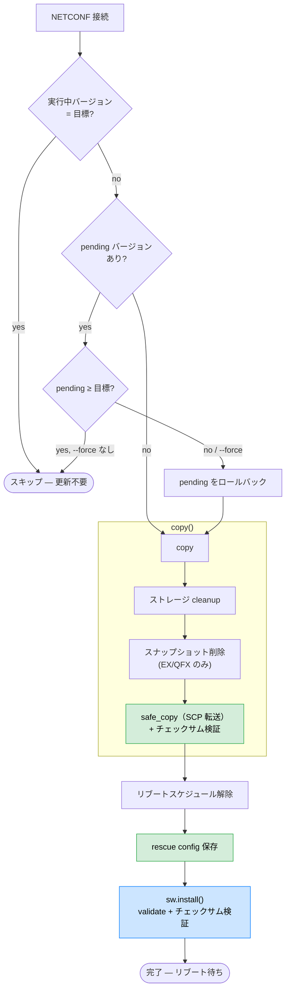
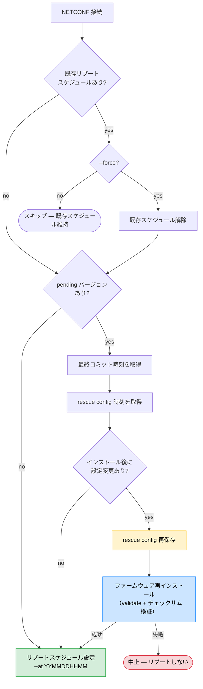
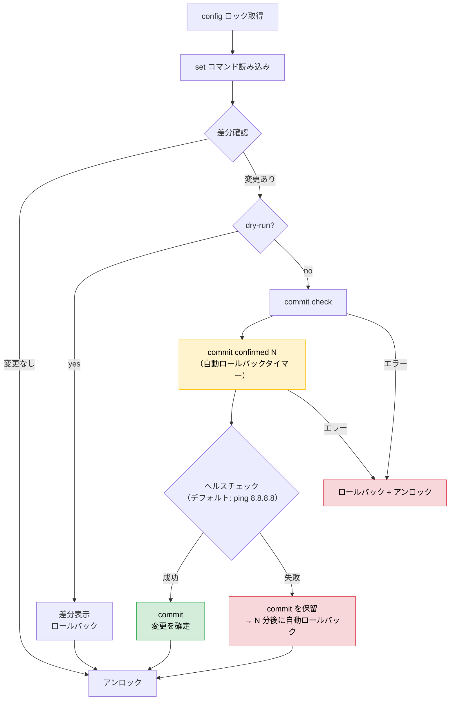

# junos-ops

[](https://pypi.org/project/junos-ops/)
[](https://github.com/shigechika/junos-ops/actions/workflows/ci.yml)
[](https://pypi.org/project/junos-ops/)

[English](https://github.com/shigechika/junos-ops/blob/main/README.md)

Juniperデバイスのモデルを自動検出し、JUNOSパッケージを自動更新するツールです。

## 特徴

- デバイスモデルの自動検出とパッケージの自動マッピング
- SCP転送＋チェックサム検証による安全なパッケージコピー
- インストール前のパッケージ検証（validate）
- ロールバック対応（MX/EX/SRXモデル別処理）
- スケジュールリブート
- RSI（request support information）/ SCF（show configuration | display set）の並列収集
- ドライランモード（`--dry-run`）で事前確認
- ThreadPoolExecutor による並列実行
- config サブコマンドの並列実行対応（`--workers` で並列数指定）
- 設定ファイル（INI形式）によるホスト・パッケージ管理

## 目次

- [インストール](#インストール)
- [設定ファイル（config.ini）](#設定ファイルconfigini)
- [使い方](#使い方)
- [ワークフロー](#ワークフロー)
- [実行例](#実行例)
- [対応モデル](#対応モデル)
- [License](#license)

## インストール

```bash
pip install junos-ops
```

最新版に更新する場合:

```bash
pip install junos-ops --upgrade
```

### 開発用インストール

```bash
git clone https://github.com/shigechika/junos-ops.git
cd junos-ops
python3 -m venv .venv
. .venv/bin/activate
pip install -e ".[test]"
```

### 依存ライブラリ

- [junos-eznc (PyEZ)](https://www.juniper.net/documentation/product/us/en/junos-pyez) — Juniper NETCONF自動化ライブラリ
- [looseversion](https://pypi.org/project/looseversion/) — バージョン比較

### タブ補完（任意）

```bash
pip install junos-ops[completion]
eval "$(register-python-argcomplete junos-ops)"
```

`eval` の行を `~/.bashrc` や `~/.zshrc` に追記すると常時有効になります。

### pip3のインストール（未導入の場合）

<details>
<summary>OS別手順</summary>

- **Ubuntu/Debian**
  ```bash
  sudo apt install python3-pip
  ```

- **CentOS/RedHat**
  ```bash
  sudo dnf install python3-pip
  ```

- **macOS**
  ```bash
  brew install python3
  ```

</details>

## 設定ファイル（config.ini）

INI形式の設定ファイルで、接続情報とモデル別パッケージを定義します。

設定ファイルは以下の順序で探索されます（`-c` / `--config` で明示指定も可能）：

1. カレントディレクトリの `./config.ini`
2. `~/.config/junos-ops/config.ini`（XDG_CONFIG_HOME）

### ログ設定（logging.ini）

`logging.ini` を配置すると、ログ出力をカスタマイズできます（例: paramiko/ncclient の冗長なログを抑制）。`config.ini` と同じ順序で探索されます：

1. カレントディレクトリの `./logging.ini`
2. `~/.config/junos-ops/logging.ini`（XDG_CONFIG_HOME）

どちらも見つからない場合は、デフォルトのログ設定（INFO レベル、stdout 出力）が使用されます。

### DEFAULTセクション

全ホスト共通の接続設定とモデル→パッケージマッピングを記述します。

```ini
[DEFAULT]
id = exadmin          # SSHユーザ名
pw = password         # SSHパスワード
sshkey = id_ed25519   # SSH秘密鍵ファイル
port = 830            # NETCONFポート
hashalgo = md5        # チェックサムアルゴリズム
rpath = /var/tmp      # リモートパス
# huge_tree = true    # 大きなXMLレスポンスを許可
# RSI_DIR = ./rsi/    # RSI/SCFファイルの出力先
# DISPLAY_STYLE = display set   # SCF出力形式（デフォルト: display set）
# DISPLAY_STYLE =               # 空にすると show configuration のみ（stanza形式）

# モデル名.file = パッケージファイル名
# モデル名.hash = チェックサム値
EX2300-24T.file = junos-arm-32-18.4R3-S10.tgz
EX2300-24T.hash = e233b31a0b9233bc4c56e89954839a8a
```

モデル名はデバイスから自動取得される`model`フィールドと一致させます。

### ホストセクション

各セクション名がホスト名になります。DEFAULTの値をホスト単位でオーバーライドできます。

```ini
[rt1.example.jp]             # セクション名がそのまま接続先ホスト名
tags = tokyo, core           # タグベースのホストフィルタリング（--tags）
[rt2.example.jp]
host = 192.0.2.1             # IPアドレスで接続先を指定
tags = osaka, core
[sw1.example.jp]
id = sw1                     # 接続ユーザを変更
sshkey = sw1_rsa             # SSH鍵を変更
tags = tokyo, access
[sw2.example.jp]
port = 10830                 # ポートを変更
[sw3.example.jp]
EX4300-32F.file = jinstall-ex-4300-20.4R3.8-signed.tgz   # このホストだけ別バージョン
EX4300-32F.hash = 353a0dbd8ff6a088a593ec246f8de4f4
```

## 使い方

```
junos-ops <subcommand> [options] [hostname ...]
```

### サブコマンド一覧

| サブコマンド | 説明 |
|-------------|------|
| `upgrade` | コピー＋インストールを一括実行 |
| `copy` | ローカルからリモートへパッケージをコピー |
| `install` | コピー済みパッケージをインストール |
| `rollback` | 前バージョンにロールバック |
| `version` | running/planning/pendingバージョンとリブート予定を表示 |
| `reboot --at YYMMDDHHMM` | 指定日時にリブートをスケジュール |
| `ls [-l]` | リモートパスのファイル一覧 |
| `config -f FILE [--confirm N] [--health-check CMD \| --no-health-check]` | set コマンドファイルを適用 |
| `rsi` | RSI/SCF を並列収集 |
| （なし） | デバイスファクト（device facts）を表示 |

### 共通オプション

| オプション | 説明 |
|-----------|------|
| `hostname` | 対象ホスト名（省略時は設定ファイル内の全ホスト） |
| `-c`, `--config CONFIG` | 設定ファイル指定（デフォルト: `config.ini` → `~/.config/junos-ops/config.ini`） |
| `-n`, `--dry-run` | テスト実行（接続とメッセージ出力のみ、実行しない） |
| `-d`, `--debug` | デバッグ出力 |
| `--force` | 条件を無視して強制実行 |
| `--tags TAG,...` | タグでホストをフィルタ（カンマ区切り、AND マッチ） |
| `--workers N` | 並列実行数（デフォルト: upgrade系=1, rsi=20） |
| `--version` | プログラムバージョン表示 |

## ワークフロー

### CLI 処理フロー

すべてのサブコマンドは共通の実行パイプラインを通ります。設定ファイルを読み込み、対象ホストを決定し（`--tags` で絞り込み可能）、`ThreadPoolExecutor` でホストごとにワーカースレッドへ振り分けます。`--workers N` で並列数を制御でき、upgrade 系はデフォルト 1（安全な逐次実行）、RSI 収集はデフォルト 20（I/O バウンドのため並列化が有効）です。各ワーカーは独立した NETCONF セッションを確立するため、ホスト間で状態を共有しません。



### JUNOS アップグレードワークフロー

ファームウェア更新はリスクを最小化する4ステップで構成されています。まず `dry-run` で接続性・パッケージの存在・チェックサムを変更なしで検証します。次に `upgrade` でコピーとインストールを実行します。`version` でインストール後の pending バージョンが想定通りか確認し、問題がなければリブートをスケジュールします。リブートを別ステップにしているのは、メンテナンスウィンドウを選択できるようにするためです。リブート前であればいつでも `rollback` で元のファームウェアに戻せます。



```
1. dry-run で事前確認
   junos-ops upgrade -n hostname

2. upgrade でコピー＋インストール
   junos-ops upgrade hostname

3. version でバージョン確認
   junos-ops version hostname

4. reboot でリブート日時を指定
   junos-ops reboot --at 2506130500 hostname
```

問題が発生した場合は `rollback` で前バージョンに戻せます。

### upgrade 内部フロー

`upgrade` サブコマンドは更新前後に複数の安全チェックを行います。まず実行中バージョンと目標バージョンを比較し、一致していればスキップします。異なる pending バージョンが存在する場合は先にロールバックしてから進行します。コピーフェーズではディスク容量を確保（ストレージ cleanup + EX/QFX ではスナップショット削除）し、`safe_copy` でチェックサム検証付きの転送を行い破損を検出します。インストール前に既存のリブートスケジュールを解除し、rescue config を復旧基点として保存します。最後に `sw.install()` がデバイス上でパッケージの整合性を検証してから適用します。



### reboot 安全フロー

`reboot` はリブートスケジュール設定前に、ファームウェアインストール後に設定変更がなかったかを自動検出します。変更があった場合は rescue config を再保存し、validation 付きで再インストールを行い、新ファームウェアと現在の設定の互換性を確認します。



### config 適用ワークフロー

`config` サブコマンドは3段階のコミットフローを採用しています。`commit confirmed`（自動ロールバックタイマー） → **ヘルスチェック** → `commit`（確定）の順に実行します。ヘルスチェックが失敗した場合、最終 `commit` を送信せず、タイマー満了時に JUNOS が自動的にロールバックします。手動操作は不要です。

デフォルトでは `ping count 3 8.8.8.8 rapid` がヘルスチェックとして実行されます。`--health-check` でカスタムコマンドを指定するか、`--no-health-check` でチェックをスキップできます。

| オプション | 説明 |
|-----------|------|
| `--health-check CMD` | ヘルスチェックコマンドを指定（デフォルト: `"ping count 3 8.8.8.8 rapid"`） |
| `--no-health-check` | commit confirmed 後のヘルスチェックをスキップ |
| `--confirm N` | commit confirmed のタイムアウト（分、デフォルト: 1） |



ヘルスチェックの成功判定は以下の通りです:

- **ping コマンド** (`ping ...`): 出力から `N packets received` を解析し、N > 0 で成功
- **それ以外のコマンド** (`show ...` 等): 例外なく実行できれば成功

```
1. dry-run で差分を確認
   junos-ops config -f commands.set -n hostname

2. 適用（デフォルトの ping ヘルスチェック付き）
   junos-ops config -f commands.set hostname

3. カスタムヘルスチェックで適用
   junos-ops config -f commands.set --health-check "ping count 5 10.0.0.1 rapid" hostname

4. ヘルスチェックなしで適用
   junos-ops config -f commands.set --no-health-check hostname
```

### タグベースのホストフィルタリング

`--tags` で config.ini に定義したタグでホストを絞り込めます。複数タグは AND マッチ（すべてのタグを持つホストのみ）。明示的なホスト名と組み合わせた場合は union（和集合）になります。

```
# tokyo タグを持つ全ホスト
junos-ops version --tags tokyo

# tokyo AND core の両方のタグを持つホスト
junos-ops version --tags tokyo,core

# タグフィルタと明示ホストの union
junos-ops version --tags core rt3.example.jp
```

## 実行例

### upgrade（パッケージ更新）

```
% junos-ops upgrade rt1.example.jp
# rt1.example.jp
remote: jinstall-ppc-18.4R3-S10-signed.tgz is not found.
copy: system storage cleanup successful
rt1.example.jp: cleaning filesystem ...
rt1.example.jp: b'jinstall-ppc-18.4R3-S10-signed.tgz': 380102074 / 380102074 (100%)
rt1.example.jp: checksum check passed.
install: clear reboot schedule successful
install: rescue config save successful
rt1.example.jp: software validate package-result: 0
```

### version（バージョン確認）

```
% junos-ops version rt1.example.jp
# rt1.example.jp
  - hostname: rt1
  - model: MX5-T
  - running version: 18.4R3-S7.2
  - planning version: 18.4R3-S10
    - running='18.4R3-S7.2' < planning='18.4R3-S10'
  - pending version: 18.4R3-S10
    - running='18.4R3-S7.2' < pending='18.4R3-S10' : Please plan to reboot.
  - reboot requested by exadmin at Sat Dec  4 05:00:00 2021
```

### rsi（RSI/SCF並列収集）

```
% junos-ops rsi --workers 5 rt1.example.jp rt2.example.jp
# rt1.example.jp
  rt1.example.jp.SCF done
  rt1.example.jp.RSI done
# rt2.example.jp
  rt2.example.jp.SCF done
  rt2.example.jp.RSI done
```

### reboot（スケジュールリブート）

```
% junos-ops reboot --at 2506130500 rt1.example.jp
# rt1.example.jp
	Shutdown at Fri Jun 13 05:00:00 2025. [pid 97978]
```

### config（set コマンドファイル適用）

set 形式のコマンドファイルを複数デバイスに適用します。commit check → commit confirmed → confirm の安全なコミットフローで実行します。

```
% cat add-user.set
set system login user viewer class read-only
set system login user viewer authentication ssh-ed25519 "ssh-ed25519 AAAA..."

% junos-ops config -f add-user.set -n rt1.example.jp rt2.example.jp
# rt1.example.jp
[edit system login]
+    user viewer {
+        class read-only;
+        authentication {
+            ssh-ed25519 "ssh-ed25519 AAAA...";
+        }
+    }
	dry-run: rollback (no commit)
# rt2.example.jp
	...

% junos-ops config -f add-user.set rt1.example.jp rt2.example.jp
# rt1.example.jp
	...
	commit check passed
	commit confirmed 1 applied
	health check: ping count 3 8.8.8.8 rapid
	health check passed (3 packets received)
	commit confirmed, changes are now permanent
# rt2.example.jp
	...
```

`--confirm N` で commit confirmed のタイムアウトを変更できます（デフォルト: 1分）。`--no-health-check` でコミット後のヘルスチェックをスキップできます。

set ファイルには `#` コメント行や空行を含めることができます。適用前に自動的に除去されます。

### show（CLI コマンド実行）

任意の CLI コマンドを複数デバイスに対して並列実行します。

```
% junos-ops show "show bgp summary" -c accounts.ini gw1.example.jp gw2.example.jp
# gw1.example.jp
Groups: 4 Peers: 6 Down peers: 0
...
# gw2.example.jp
Groups: 3 Peers: 4 Down peers: 0
...
```

`-f` でファイルから複数コマンドを読み込み、デバイスごとに1つの NETCONF セッション内で順次実行します。

```
% cat commands.txt
# セキュリティポリシー確認
show security policies hit-count
show security flow session summary

% junos-ops show -f commands.txt -c accounts.ini fw1.example.jp
# fw1.example.jp
## show security policies hit-count
...

## show security flow session summary
...
```

> **注意:** JUNOS CLI のパイプフィルタ（`| match`、`| count` 等）は使用できません。PyEZ の `dev.cli()` は NETCONF RPC 経由でコマンドを送信するため、パイプ修飾子は処理されません。出力のフィルタにはシェル側のツール（`grep` 等）を使用してください。

### 引数なし（デバイスファクト表示）

```
% junos-ops gw1.example.jp
# gw1.example.jp
{'2RE': True,
 'hostname': 'gw1',
 'model': 'MX240',
 'version': '18.4R3-S7.2',
 ...}
```

## 対応モデル

設定ファイルでモデル名とパッケージファイルを定義することで、任意のJuniperモデルに対応できます。設定例に含まれるモデル:

| シリーズ | モデル例 |
|---------|---------|
| EX | EX2300-24T, EX3400-24T, EX4300-32F |
| MX | MX5-T, MX240 |
| QFX | QFX5110-48S-4C |
| SRX | SRX300, SRX345, SRX1500, SRX4600 |

## License

[Apache License 2.0](LICENSE)

Copyright 2022-2025 AIKAWA Shigechika
