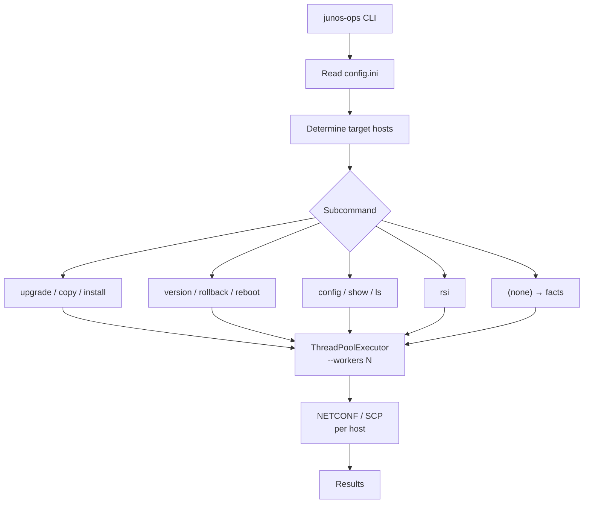
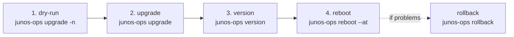
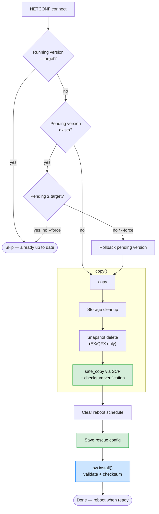
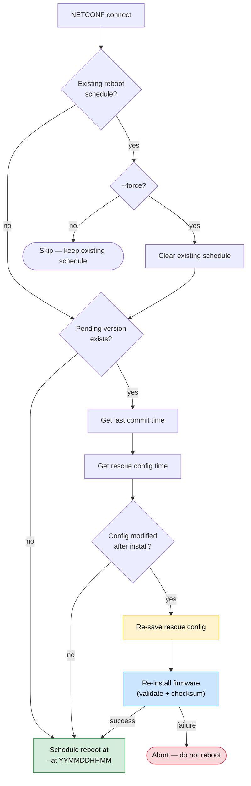
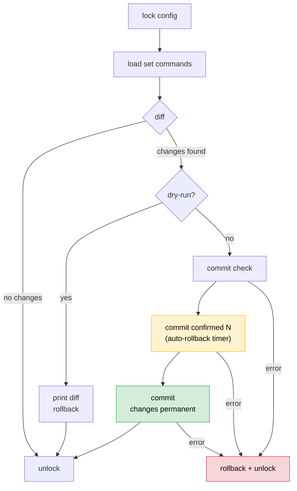

# junos-ops

[](https://pypi.org/project/junos-ops/)
[](https://github.com/shigechika/junos-ops/actions/workflows/ci.yml)
[](https://pypi.org/project/junos-ops/)

[日本語版 / Japanese](https://github.com/shigechika/junos-ops/blob/main/README.ja.md)

A tool for automatic detection of Juniper device models and automated JUNOS package updates.

## Features

- Automatic device model detection and package mapping
- Safe package copy via SCP with checksum verification
- Pre-install package validation
- Rollback support (model-specific handling for MX/EX/SRX)
- Scheduled reboot
- Parallel RSI (request support information) / SCF (show configuration | display set) collection
- Dry-run mode (`--dry-run`) for pre-flight verification
- Parallel execution via ThreadPoolExecutor
- Configuration push with commit confirmed safety (parallel execution supported)
- INI-based host and package management

## Table of Contents

- [Installation](#installation)
- [Configuration File (config.ini)](#configuration-file-configini)
- [Usage](#usage)
- [Workflow](#workflow)
- [Examples](#examples)
- [Supported Models](#supported-models)
- [License](#license)

## Installation

```bash
pip install junos-ops
```

To upgrade to the latest version:

```bash
pip install junos-ops --upgrade
```

### Development Setup

```bash
git clone https://github.com/shigechika/junos-ops.git
cd junos-ops
python3 -m venv .venv
. .venv/bin/activate
pip install -e ".[test]"
```

### Dependencies

- [junos-eznc (PyEZ)](https://www.juniper.net/documentation/product/us/en/junos-pyez) — Juniper NETCONF automation library
- [looseversion](https://pypi.org/project/looseversion/) — Version comparison

### Tab Completion (optional)

```bash
pip install junos-ops[completion]
eval "$(register-python-argcomplete junos-ops)"
```

Add the `eval` line to your shell profile (`~/.bashrc` or `~/.zshrc`) to enable it permanently.

### Installing pip3 (if not available)

<details>
<summary>OS-specific instructions</summary>

- **Ubuntu/Debian**
  ```bash
  sudo apt install python3-pip
  ```

- **CentOS/RedHat**
  ```bash
  sudo dnf install python3-pip
  ```

- **macOS**
  ```bash
  brew install python3
  ```

</details>

## Configuration File (config.ini)

An INI-format configuration file that defines connection settings and model-to-package mappings.

The configuration file is searched in the following order (`-c` / `--config` can override):

1. `./config.ini` in the current directory
2. `~/.config/junos-ops/config.ini` (XDG_CONFIG_HOME)

### Logging Configuration (logging.ini)

An optional `logging.ini` file can be used to customize log output (e.g., suppress verbose paramiko/ncclient messages). The file is searched in the same order as `config.ini`:

1. `./logging.ini` in the current directory
2. `~/.config/junos-ops/logging.ini` (XDG_CONFIG_HOME)

If neither is found, the default logging configuration (INFO level to stdout) is used.

### DEFAULT Section

Defines global connection settings and model-to-package mappings shared by all hosts.

```ini
[DEFAULT]
id = exadmin          # SSH username
pw = password         # SSH password
sshkey = id_ed25519   # SSH private key file
port = 830            # NETCONF port
hashalgo = md5        # Checksum algorithm
rpath = /var/tmp      # Remote path
# huge_tree = true    # Allow large XML responses
# RSI_DIR = ./rsi/    # Output directory for RSI/SCF files
# DISPLAY_STYLE = display set   # SCF output style (default: display set)
# DISPLAY_STYLE =               # Empty for stanza format (show configuration only)

# model.file = package filename
# model.hash = checksum value
EX2300-24T.file = junos-arm-32-18.4R3-S10.tgz
EX2300-24T.hash = e233b31a0b9233bc4c56e89954839a8a
```

The model name must match the `model` field automatically retrieved from the device.

### Host Sections

Each section name becomes the hostname. DEFAULT values can be overridden per host.

```ini
[rt1.example.jp]             # Section name is used as the connection hostname
[rt2.example.jp]
host = 192.0.2.1             # Override connection target with IP address
[sw1.example.jp]
id = sw1                     # Override SSH username
sshkey = sw1_rsa             # Override SSH key
[sw2.example.jp]
port = 10830                 # Override port
[sw3.example.jp]
EX4300-32F.file = jinstall-ex-4300-20.4R3.8-signed.tgz   # Different version for this host
EX4300-32F.hash = 353a0dbd8ff6a088a593ec246f8de4f4
```

## Usage

```
junos-ops <subcommand> [options] [hostname ...]
```

### Subcommands

| Subcommand | Description |
|------------|-------------|
| `upgrade` | Copy and install package |
| `copy` | Copy package from local to remote |
| `install` | Install a previously copied package |
| `rollback` | Rollback to the previous version |
| `version` | Show running/planning/pending versions and reboot schedule |
| `reboot --at YYMMDDHHMM` | Schedule a reboot at the specified time |
| `ls [-l]` | List files on the remote path |
| `config -f FILE [--confirm N]` | Push a set command file to devices |
| `rsi` | Collect RSI/SCF in parallel |
| (none) | Show device facts |

### Common Options

| Option | Description |
|--------|-------------|
| `hostname` | Target hostname(s) (defaults to all hosts in config file) |
| `-c`, `--config CONFIG` | Config file path (default: `config.ini` or `~/.config/junos-ops/config.ini`) |
| `-n`, `--dry-run` | Test run (connect and display messages only, no execution) |
| `-d`, `--debug` | Debug output |
| `--force` | Force execution regardless of conditions |
| `--workers N` | Parallel workers (default: 1 for upgrade, 20 for rsi) |
| `--version` | Show program version |

## Workflow

### CLI Architecture Overview

All subcommands share the same execution pipeline: read the config file, determine target hosts, then dispatch each host to a worker thread via `ThreadPoolExecutor`. The `--workers N` option controls parallelism — defaulting to 1 for upgrade operations (safe sequential execution) and 20 for RSI collection (I/O-bound, benefits from concurrency). Each worker establishes its own NETCONF session, so hosts are processed independently with no shared state.



### JUNOS Upgrade Workflow

A firmware upgrade follows a four-step sequence designed to minimize risk. First, `dry-run` verifies connectivity, package availability, and checksum without making changes. Then `upgrade` copies and installs the package. `version` confirms the pending version matches expectations before scheduling the reboot. The reboot is scheduled separately so you can choose a maintenance window. If anything goes wrong, `rollback` reverts to the previous firmware at any point before reboot.



```
1. Pre-flight check with dry-run
   junos-ops upgrade -n hostname

2. Copy and install with upgrade
   junos-ops upgrade hostname

3. Verify version
   junos-ops version hostname

4. Schedule reboot
   junos-ops reboot --at 2506130500 hostname
```

Use `rollback` to revert to the previous version if problems occur.

### Upgrade Internal Flow

The `upgrade` subcommand runs multiple safety checks before and during the update process. It first compares the running version against the target — skipping entirely if already up to date. If a different pending version exists, it rolls that back before proceeding. The copy phase frees disk space (storage cleanup + snapshot delete on EX/QFX), then transfers the package via `safe_copy` with checksum verification to detect corruption. Before installing, it clears any existing reboot schedule and saves the rescue config as a recovery baseline. Finally, `sw.install()` validates the package integrity on the device before applying it.



### Reboot Safety Flow

Before scheduling a reboot, `reboot` automatically checks whether the configuration was modified after the firmware install. If changes are detected, it re-saves the rescue config and re-installs with validation to ensure the new firmware is compatible with the current config.



### Config Push Workflow

The `config` subcommand uses a two-phase commit: `commit confirmed` (auto-rollback timer) followed by `commit` (permanent). If the second commit is not issued within the timeout, JUNOS automatically rolls back the change.



```
1. Preview changes with dry-run
   junos-ops config -f commands.set -n hostname

2. Apply changes
   junos-ops config -f commands.set hostname
```

## Examples

### upgrade (package update)

```
% junos-ops upgrade rt1.example.jp
# rt1.example.jp
remote: jinstall-ppc-18.4R3-S10-signed.tgz is not found.
copy: system storage cleanup successful
rt1.example.jp: cleaning filesystem ...
rt1.example.jp: b'jinstall-ppc-18.4R3-S10-signed.tgz': 380102074 / 380102074 (100%)
rt1.example.jp: checksum check passed.
install: clear reboot schedule successful
install: rescue config save successful
rt1.example.jp: software validate package-result: 0
```

### version (version check)

```
% junos-ops version rt1.example.jp
# rt1.example.jp
  - hostname: rt1
  - model: MX5-T
  - running version: 18.4R3-S7.2
  - planning version: 18.4R3-S10
    - running='18.4R3-S7.2' < planning='18.4R3-S10'
  - pending version: 18.4R3-S10
    - running='18.4R3-S7.2' < pending='18.4R3-S10' : Please plan to reboot.
  - reboot requested by exadmin at Sat Dec  4 05:00:00 2021
```

### rsi (parallel RSI/SCF collection)

```
% junos-ops rsi --workers 5 rt1.example.jp rt2.example.jp
# rt1.example.jp
  rt1.example.jp.SCF done
  rt1.example.jp.RSI done
# rt2.example.jp
  rt2.example.jp.SCF done
  rt2.example.jp.RSI done
```

### reboot (scheduled reboot)

```
% junos-ops reboot --at 2506130500 rt1.example.jp
# rt1.example.jp
	Shutdown at Fri Jun 13 05:00:00 2025. [pid 97978]
```

### config (push set command file)

Push a set-format command file to multiple devices. Uses a safe commit flow: commit check, commit confirmed, then confirm.

```
% cat add-user.set
set system login user viewer class read-only
set system login user viewer authentication ssh-ed25519 "ssh-ed25519 AAAA..."

% junos-ops config -f add-user.set -n rt1.example.jp rt2.example.jp
# rt1.example.jp
[edit system login]
+    user viewer {
+        class read-only;
+        authentication {
+            ssh-ed25519 "ssh-ed25519 AAAA...";
+        }
+    }
	dry-run: rollback (no commit)
# rt2.example.jp
	...

% junos-ops config -f add-user.set rt1.example.jp rt2.example.jp
# rt1.example.jp
	...
	commit check passed
	commit confirmed 1 applied
	commit confirmed, changes are now permanent
# rt2.example.jp
	...
```

Use `--confirm N` to change the commit confirmed timeout (default: 1 minute).

### No subcommand (show device facts)

```
% junos-ops gw1.example.jp
# gw1.example.jp
{'2RE': True,
 'hostname': 'gw1',
 'model': 'MX240',
 'version': '18.4R3-S7.2',
 ...}
```

## Supported Models

Any Juniper model can be supported by defining the model name and package file in the configuration file. Models included in the example configuration:

| Series | Example Models |
|--------|---------------|
| EX | EX2300-24T, EX3400-24T, EX4300-32F |
| MX | MX5-T, MX240 |
| QFX | QFX5110-48S-4C |
| SRX | SRX300, SRX345, SRX1500, SRX4600 |

## License

[Apache License 2.0](LICENSE)

Copyright 2022-2025 AIKAWA Shigechika
